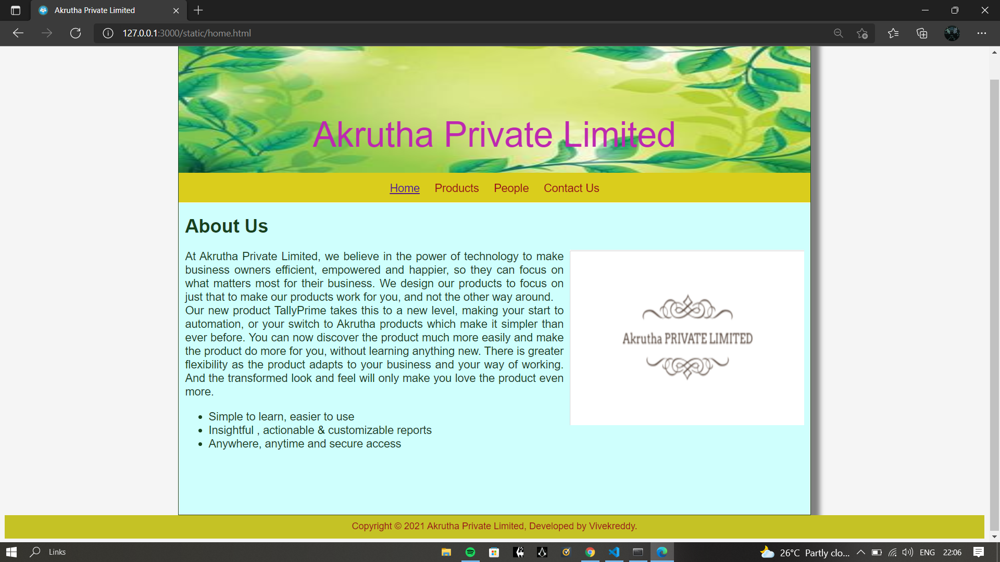
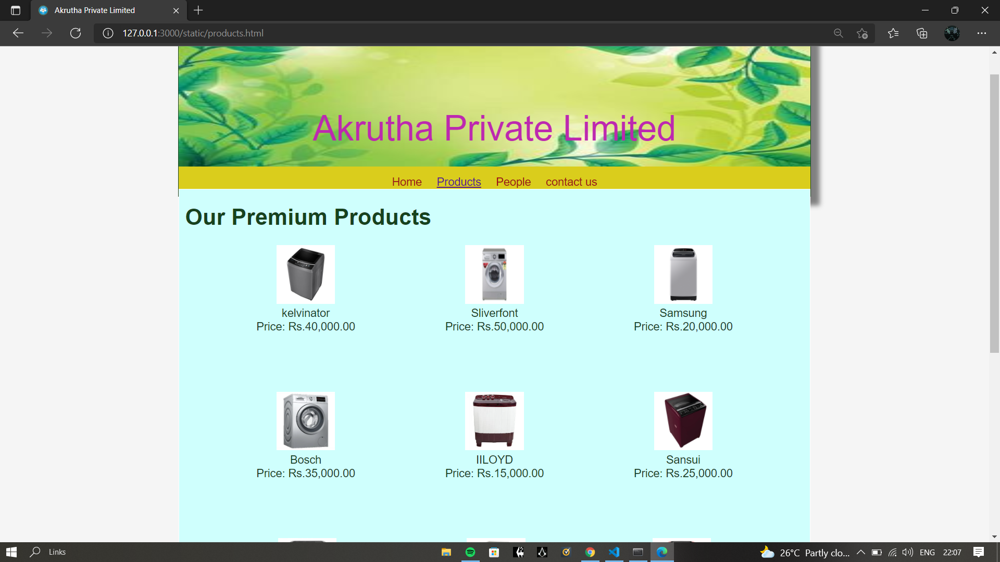
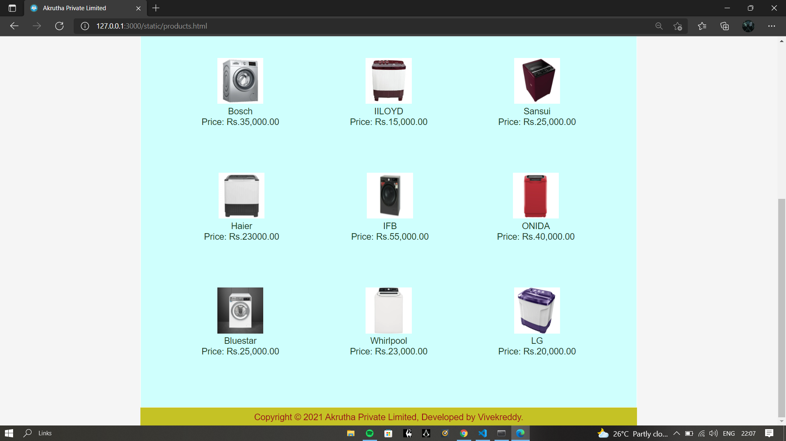
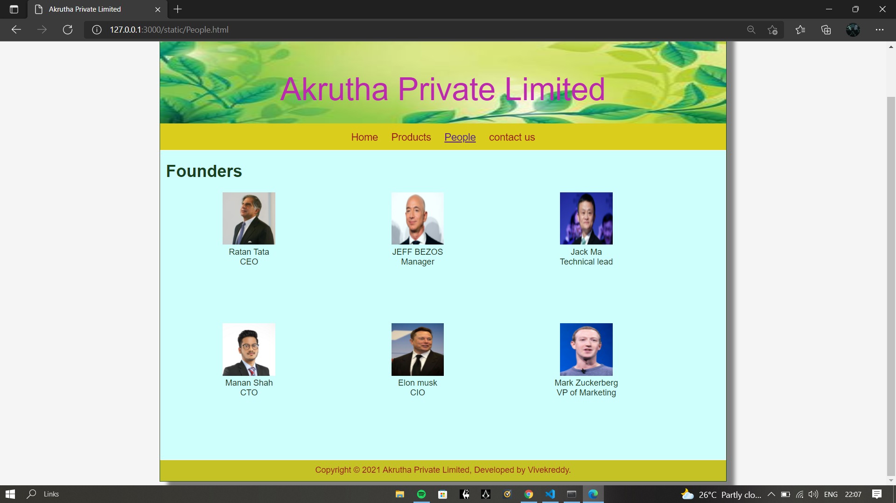
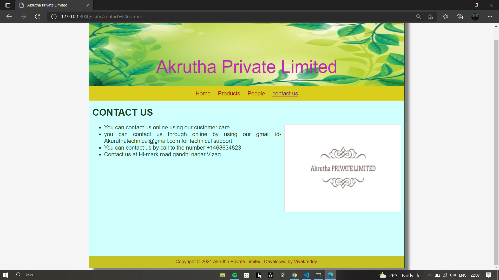

# Web Design for a Software Product Company

## AIM:

To design a static website for a software product company company.

## DESIGN STEPS:

### Step 1:

Requirement collection.

### Step 2:

Creating the layout using HTML and CSS.

### Step 3:

Updating the sample content.

### Step 4:

Choose the appropriate style and color scheme.

### Step 5:

Validate the layout in various browsers.

### Step 6:

Validate the HTML code.

### Step 6:

Publish the website in the given URL.

## PROGRAM :

### CSS:
~~~
* {
  box-sizing: border-box;
  font-family: Arial, Helvetica, sans-serif;
}
body {
  background-color: whitesmoke;
  color: #17421d;
}
.container {
  width: 1080px;
  margin-left: auto;
  margin-right: auto;
  border-width: 1px 1px 1px 1px;
  border-style: solid;
  box-shadow: 15px 15px 8px gray;
}

.banner {
  display: block;
  width: 100%;
  height: 250px;
  text-align: center;
  font-size: 60px;
  background-image: url("https://static.vecteezy.com/system/resources/thumbnails/003/471/376/small/nature-green-background-free-vector.jpg");
  background-size: 100% 100%;
  margin: 0px 0px 0px 0px;
  padding-top: 150px;
  color: #bd28b0;
}

.menu {
  display: block;
  width: 100%;
  height: 50px;
  font-size: larger;
  background-color: #dacd1c;
  text-align: center;
  padding-top: 15px;
  margin: 0px 0px 0px 0px;
  border-width: 1px;
}

.menuitem {
  display: inline-block;
  margin-left: 10px;
  margin-right: 10px;
}
.menuitemselected {
  display: inline-block;
  margin-left: 10px;
  margin-right: 10px;
  color: #ddd013;
}

.menuitem a {
  text-decoration: none;
  color: #9c1018;
}

.content {
  display: block;
  width: 100%;
  background-color: #cffffd;
  min-height: 500px;
  margin: 0px 0px 0px 0px;
  border-width: 1px;
  border-color: white;
  border-style: solid;
}
.homecontent {
  min-height: 500px;
  margin: 10px 10px 10px 10px;
}
.homecontent h1 {
  text-align: left;
}
.homecontent img {
  float: right;
  width: 400px;
  height: 300px;
  margin-left: 10px;
}

.contenttext {
  text-align: justify;
  font-size: larger;
}

.productcontent {
  min-height: 500px;
  margin: 10px 10px 10px 10px;
}

.productcontent h1 {
  text-align: left;
}

.productitems {
  display: block;
}

.productitem {
  display: inline-block;
  width: 30%;
  height: 250px;
  text-align: center;
}

.productitem img {
  width: 100px;
  height: 100px;
  display: block;
}
.productitem .itemimage {
  display: block;
  margin-left: auto;
  margin-right: auto;
  width: 100px;
  margin-bottom: 5px;
}

.productitem .itemname {
  display: block;
}
.productitem .itemprice {
  display: block;
}

.footer {
  display: block;
  width: 100%;
  height: 40px;
  background-color: #c5c225;
  text-align: center;
  padding-top: 10px;
  margin: 0px 0px 0px 0px;
  color: #9c1018;
}
~~~

### Home Page:
~~~
<!DOCTYPE html>
<html lang="en">
  <head>
    <title>Akrutha Private Limited</title>
    <link rel="stylesheet" href="./css/layout.css" />
    <link rel="icon" href="./img/icon.png" type="image/x-icon" />
  </head>

  <body>
    

      
Akrutha Private Limited

      

        
<a href="/static/home.html">Home</a>

        
<a href="/static/products.html">Products</a>

        
<a href="/static/People.html">People</a>

        
<a>Contact Us</a>

      

      
      

        

          <h1>About Us</h1>
          
          

            At Akrutha Private Limited, we believe in the power of technology to make business
            owners efficient, empowered and happier, so they can focus on what
            matters most for their business. We design our products to focus on
            just that to make our products work for you, and not the other way
            around.
             

            Our new product TallyPrime takes this to a new level, making your
            start to automation, or your switch to Akrutha products which make it simpler than ever
            before. You can now discover the product much more easily and make
            the product do more for you, without learning anything new. There is
            greater flexibility as the product adapts to your business and your
            way of working. And the transformed look and feel will only make you
            love the product even more.
            <ul>
              <li>Simple to learn, easier to use</li>
              <li>Insightful , actionable & customizable reports</li>
              <li>Anywhere, anytime and secure access</li>
            </ul>
          

        

      

    

      
      

        Copyright &#169; 2021 Akrutha Private Limited, Developed by Vivekreddy.
      

    

  </body>
</html>
~~~

### Product Page:
~~~
<!DOCTYPE html>
<html lang="en">
  <head>
    <title>Akrutha Private Limited</title>
    <link rel="stylesheet" href="./css/layout.css" />
    <link rel="icon" href="./img/icon.png" type="image/x-icon" />
  </head>

  <body>
    

      
Akrutha Private Limited

      

        
<a href="/static/home.html">Home</a>

        
<a href="/static/products.html">Products</a>

        
<a href="/static/People.html">People</a>

        
<a href="/static/contact us.html">contact us</a>

      

        
    
          <h1>Our Premium Products</h1>
          

              
 
                  

                  
                  

                  
kelvinator

                  
Price: Rs.40,000.00 

              

              
 
                  

                  
                  

                  
Sliverfont

                  
Price: Rs.50,000.00 

              

              
 
                

                
                

                
Samsung

                
Price: Rs.20,000.00 

            

            
 
              

              
              

              
Bosch

              
Price: Rs.35,000.00 

          

          
 
            

            
            

            
IILOYD

            
Price: Rs.15,000.00 

        

        
 
          

          
          

          
Sansui

          
Price: Rs.25,000.00 

      

      
 
        

        
        

        
Haier

        
Price: Rs.23000.00 

    

    
 
      

      
      

      
IFB

      
Price: Rs.55,000.00 

  

 
    

    
    

    
ONIDA

    
Price: Rs.40,000.00 

 
  

  
  

  
Bluestar

  
Price: Rs.25,000.00 

 
  

  
  

  
Whirlpool

  
Price: Rs.23,000.00 

 
  

  
  

  
LG

  
Price: Rs.20,000.00 

          

          
        
      

      

        Copyright &#169; 2021 Akrutha Private Limited, Developed by Vivekreddy.
      

    

  </body>
</html>
~~~

### People Page:
~~~
<!DOCTYPE html>
<html lang="en">
  <head>
    <title>Akrutha Private Limited</title>
    <link rel="stylesheet" href="./css/layout.css" />
    <link rel="icon" href="./img/ico.jpeg" type="image/x-icon" />
  </head>

  <body>
    

      
Akrutha Private Limited

      

        
<a href="/static/home.html">Home</a>

        
<a href="/static/products.html">Products</a>

        
<a href="/static/People.html">People</a>

        
<a href="/static/contact us.html">contact us</a>

      

      

        
    
          <h1>Founders</h1>
          

              
 
                  

                  
                  

                  
Ratan Tata

                  
CEO

              

              
 
                  

                  
                  

                  
JEFF BEZOS

                  
Manager

              

              
 
                

                
                

                
Jack Ma

                
Technical lead

                

                
 
                    

                    
                    

                    
Manan Shah

                    
CTO

                    

                    
 
                        

                        
                        

                        
Elon musk

                        
CIO

                        

                        
 
                            

                            
                            

                            
Mark Zuckerberg

                            
VP of Marketing

                            

                
          

          
        
      

      

        Copyright &#169; 2021 Akrutha Private Limited, Developed by Vivekreddy.
      

    

  </body>
</html>
~~~

### Contact Us Page:
~~~
<!DOCTYPE html>
<html lang="en">
  <head>
    <title>Akrutha Private Limited</title>
    <link rel="preconnect" href="https://fonts.googleapis.com">
    <link rel="preconnect" href="https://fonts.googleapis.com">
    <link rel="stylesheet" href="./css/layout.css" />
    <link rel="icon" href="./img/ico.jpeg" type="image/x-icon" />
  </head>

  <body>
    

      
Akrutha Private Limited

      

        
<a href="/static/home.html">Home</a>

        
<a href="/static/products.html">Products</a>

        
<a href="/static/People.html">People</a>

        
<a href="/static/contact us.html">contact us</a>

      

      

        

          <h1>CONTACT US</h1>
          
          

           
            <ul>
              <li>You can contact us online using our customer care.</li>
              <li>you can contact us through online by using our gmail id-Akuruthatechnical@gmail.com for technical support.</li>
              <li>You can contact us by call to the number +1468634823 </li>
              <li>Contact us at Hi-mark road,gandhi nagar,Vizag.</li>
            </ul>
          

        

      

      

        Copyright &#169; 2021 Akrutha Private Limited, Developed by Vivekreddy.
      

    

  </body>
</html>
~~~

## OUTPUT:

### Home Page:

### Product Page:

### People Page:

### Contact Us Page:

## Result:

Thus a website is designed for the software product company and the HTML,CSS code are validated.
